# Ryan Yang

Building the last mile of AI work.

I make open-source tools that help agents and developers create, publish, verify, and reuse real outcomes.

[Website](https://bio.ruiy.sh) · [X / Twitter](https://x.com/ruiyanghim) · [Email](mailto:ruiyang0012@gmail.com)

<picture>
  
</picture>

## Selected systems

| System | Role | Current release |
| --- | --- | --- |
| [DropHere](https://github.com/Ryan-yang125/drophere) | Publish static sites from coding-agent sessions | <!-- version:drophere -->v1.0.1<!-- /version:drophere --> |
| [CheckHere](https://github.com/Ryan-yang125/checkhere) | Run release checks for AI-built websites | <!-- version:checkhere -->v0.4.0<!-- /version:checkhere --> |
| [Skill Manager](https://github.com/Ryan-yang125/skill-manager) | Audit and clean Agent Skills safely | <!-- version:skill-manager -->v0.6.0<!-- /version:skill-manager --> |
| [Motion Lexicon](https://github.com/Ryan-yang125/motion-lexicon) | Bilingual UI motion recipes for humans and agents | Open source |

Also built [ChatLLM-Web](https://github.com/Ryan-yang125/ChatLLM-Web), a private in-browser LLM powered by WebGPU · <!-- stars:chatllm -->630<!-- /stars:chatllm --> stars

---

`Agent Skills` · `TypeScript` · `Cloudflare` · `Browser automation` · `Generative interfaces`

This profile refreshes daily from GitHub releases and contribution activity.
